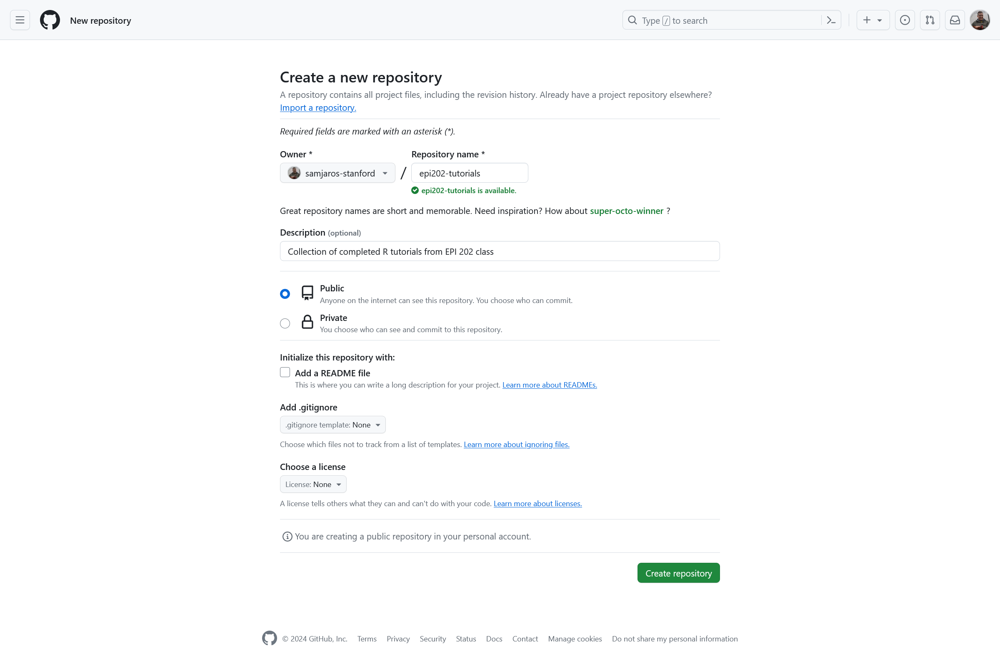
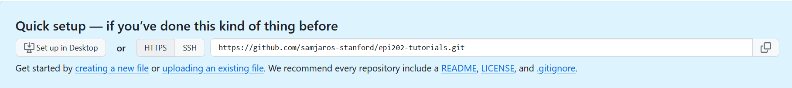
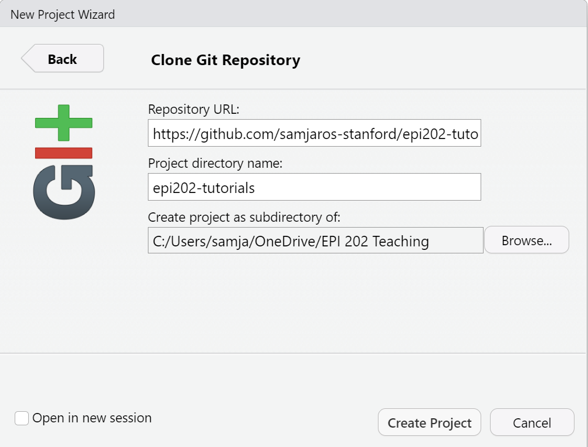
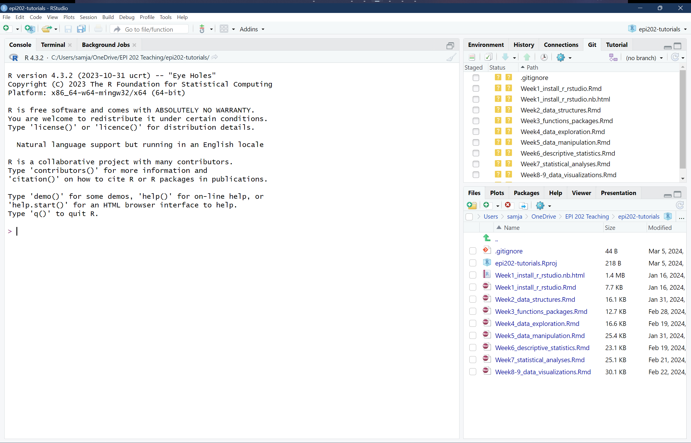
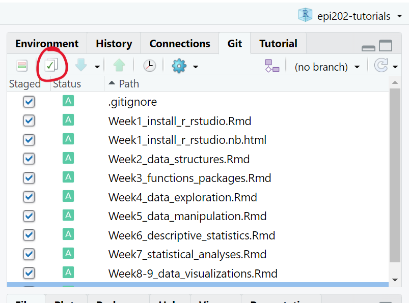
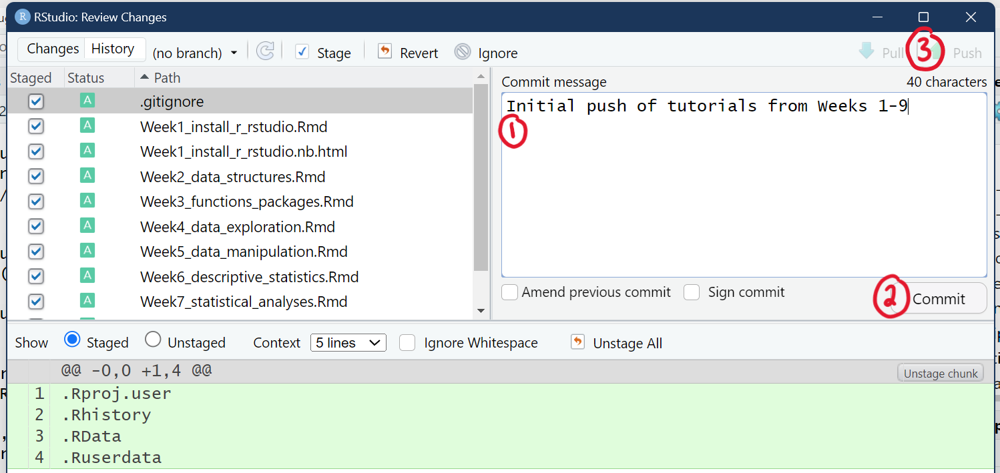
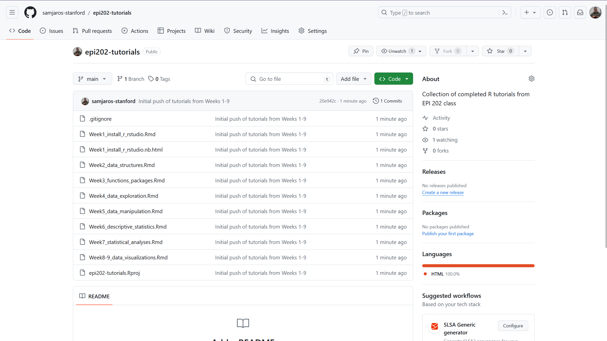

This is a new line.

For our last week of this course, we want to take a step back and take a look at some other tools you can use to make your research more collaborative and more reproducible. This material will not be on the final. Instead, we hope you absorb this week's material to use in your future work.

# Collaborative Coding through GitHub

While many analyses may just be you running code on your computer, larger projects with larger research teams my require you to collaborate on code. The main way to collaboratively code is by using `git` and GitHub. To quickly note the difference between these two, `git` is an open source program that you computer uses to interact with GitHub which is a website owned by Microsoft.

## Why use GitHub

Collaborative coding is a little different than collaborating on, say, a Google Doc. When you are writing a word document, multiple people can log in and work on the same document at the same time. This type of collaboration does not work for coding. Imagine you are working on one part of the code that adds two variables together, but your collaborator is simultaneously working on another part of the document changing the names of those variables. Your code would refuse to run, and you would have no idea why! Rather than everyone working on the same copy of the code, GitHub allows everyone to have their own `local` copy, and GitHub stores a `remote` copy too. We call these collaborative projects `repositories` or, simply, `repos`.

## Sign up for GitHub and install GitHub Desktop

1.  Go to <https://github.com/> and sign up for a GitHub account. You can choose to use your stanford.edu email address, but remember that you will lose access to this account if you stop being affiliated with Stanford.
2.  Dowload [GitHub Desktop](https://desktop.github.com/). GitHub Desktop installs all the programs you need to interact with GitHub and makes it easy to sign in, upload code, and pull code down.
3.  After it finishes installing, GitHub Desktop should open, and you can sign in to your GitHub account.

## Create a new repo

Let's put all of our completed tutorials for this class on GitHub so that we can reference them in the future. **Remember that files you put on a public repo are public for the whole internet to see, so we don't want to upload private files.**

1.  Go to [github.com](github.com) and click on the + button in the top right, then click "New repository".
2.  Give your repo an informative name like `epi202-tutorials`. Your repository name cannot have spaces in it.
3.  Write a short description for the repo.
4.  Leave the repo as "Public". You should ***never*** upload patient data to GitHub, even if you set the repo to "Private".
5.  Check the box next to "Add a README file"
6.  Under Add .gitignore, find the "R" option
7.  You can leave License as "None"

So your "New repository" window should look something like this:

{width="634"}

Then click "Create repository" You now have a repo `epi202-tutorials` associated with your GitHub account. GitHub will show you a page with information on how to setup your repo. Make sure to keep this page open because you will use the blue box for the next step!

## Add your repo to RStudio

Now that we made our repo, we can open that repo in RStudio to start adding and editing our files. If you have trouble with the tutorial below, try completely closing out of RStudio and opening it back up so that it can recognize you have installed GitHub.

1.  In RStudio, click File \> New Project... \> Version Control \> Git

2.  We will then take the URL from the blue box on GitHub and paste it in the "Repository URL" field. After pasting the URL in RStudio, it should autofill the repo name. You should pick a good folder for this project to go in, like your EPI 202 class folder.

    

    {width="411"}

3.  When you click "Create Project", RStudio will open a new project based on what is inside your GitHub repo. You now have an `epi202-tutorials` folder on your computer that is associated with your `epi202-tutorials` repo on GitHub!

4.  Take the completed tutorials from your class folder and copy them into the `epi202-tutorials` folder on your computer. You should see the files appear in your "Files" pane in RStudio.

    {width="590"}

## Push your changes to GitHub

We made these changes to our `local` copy. To send these changes to the `remote` copy, we have to `commit` these changes. You may have noticed the "Git" tab has appeared in the top right of your RStudio. This tab will help us interract with GitHub.

1.  Check all the boxes next to the files. We are saying that we want to send those files to the `remote` copy on GitHub.

    {width="282"}

2.  Click on the green check (circled in red) to review your changes. You can see all of your changes by clicking on each of the files. Added lines are in green. Deleted lines (if we had any) would be shown in red.

3.  Add a commit message describing your changes, click "Commit", and then click "Push".

    

If we go back to our repo on github.com, we can see our files are now there!

{width="610"}

## GitHub Workflow

As you and others work in RStudio on your project, you need to be sure to pull in changes others have made and push out changes you have made.

-   Before you start working, click the blue down arrow in the Git tab of RStudio. This button will **pull** in any changes that others have made, or say "Already up to date" if no one else has made changes.

-   After your code is working the way you want it to, follow steps 1-3 in the section above to add, commit, and **push** your changes to GitHub so that others can pull them into their RStudio.

# Reproducible Research with the Open Science Foundation

One of the greatest strengths of the scientific method is its circularity where findings lead to new hypotheses which are tested leading to new findings. Scientific findings are validated and eventually become theories through replication, so we want to make sure our studies follow best practices of reproducible research. **Reproducible research** refers to science that could, theoretically, be exactly replicated by another researcher. It may be difficult or impossible to exactly replicate results in the health sciences as data are often restricted and patients are constantly changing. Instead, we rely on reproducible methods whereby other researchers can replicate our methods in a different population thereby validating our results.

## Why use OSF

Outlining your project on OSF provides you a public record of your project planning, data, code, and findings. This record can be useful if reviewers ever call into question your methodology. Some researchers may take an observational dataset with many variables and run statistical tests until they get a significant result. Registering your analysis plan before you do your analysis prevents this kind of bad statistics often called p-hacking. It also provides a single location to upload data, if it can be made public, to comply with the new NIH data sharing rules. For students, writing out your project plan in this form gives you an opportunity to get feedback from mentors and fix potential issues before you start coding.

## Look at an Example Project

Check out [this OSF](https://osf.io/wvyn4/) project by Dr. Ben Arnold.

1.  On the landing page, you can see a quick summary of the project, the components of the project, and the recent activity on the project. Every action in the project is logged so that it can be tracked through time to see how the protocol changes.
2.  If you scroll through the "Files" to "Scripts" or just click on "Scripts" in the "Components" area, you can see it is linked to their github tracking the analysis for the project.
3.  You can click on the "Registrations" tab to switch over to see the snapshot of the project the author took before doing the primary analysis, capturing the primary analysis plan.

Consider giving OSF a shot in your research flow to organize your plans, code, and data all in one place!

# A Reminder to Organize Your Class R Project

Remember in week 1 when we set up projects in R Studio to keep your pre-lecture tutorials, in-class work, homeworks, and data organized? Have you been staying organized?

We strongly encourage you to look through those folders and make sure you have all of your course materials organized. Your notes and tutorials will be highly useful reference material as you grow as an R data analyst, but they will be no help if they are lost on your computer somewhere.

# How do I take my R coding to the next level?

Here are some class recommendations to improve your R coding! Now that you know the basics, you can start diving into different specialties to get a better picture of how to use R for certain analyses.

[**BIOMEDIN 215: Data Science for Medicine**](https://explorecourses.stanford.edu/search?q=BIOMEDIN%20215:%20Data%20Science%20for%20Medicine) **- Autumn - 3 units**

-   Understand, merge, and clean electronic health record data

-   Identify the advantages and limitations to different approaches for different research questions

[**EPI 203 - Methods for Reproducible Population Health and Clinical Research**](https://explorecourses.stanford.edu/search?q=epi+203) **- Spring - 2 units**

-   Cover rules, ethics, and principles of research integrity

-   Third module of the course is how to do reproducible research with GitHub and R

[**EPI 227 - Advanced Epidemiologic Methods**](https://explorecourses.stanford.edu/search?q=EPI+227) **- Autumn - 3 units**

-   Understand how to answer causal questions

-   Implement causal analysis techniques in R

[**EPI 262 - Intermediate Biostatistics: Regression, Prediction, Survival Analysis**](https://explorecourses.stanford.edu/search?q=%20EPI%20262:%20Intermediate%20Biostatistics:%20Regression,%20Prediction,%20Survival%20Analysis) **- Spring - 3 units**

-   Clean data and run models for longitudinal and survival outcomes

-   Understand the statistical assumptions within the models

[**STATS 216 - Introduction to Statistical Learning**](https://explorecourses.stanford.edu/search?q=STATS%20216:%20Introduction%20to%20Statistical%20Learning) **- Winter - 3 units**

-   Dive into statistical learning techniques with some math but focus on real-world applications

-   Gain true mastery of ggplot

[**STATS 256 - Modern Statistics for Modern Biology**](https://explorecourses.stanford.edu/search?q=stats+256) **- Autumn - 3 units**

-   More advanced statistical methods including machine learning

-   Advanced use of R to solve real-world data issues
